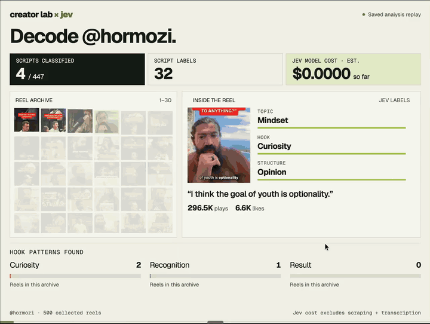

# Creator Lab

[](https://novitckii.com/lib/creator-lab/jev-demo.mp4)

**[Watch the full-quality demo](https://novitckii.com/lib/creator-lab/jev-demo.mp4)** · [Download MP4](docs/assets/creator-lab-demo.mp4) · Saved analysis replay

Turn a creator's Instagram Reels into a searchable research library. Filter by topic and hook, compare engagement, read the scripts, and open the original posts behind each pattern.

Built with **Apify → Fireworks or Groq → a Jev-compatible classifier**. Classification runs locally by default with [Laya](https://github.com/receptron/laya), the open-source Jev-compatible model; [TypeSafe Jev](https://docs.typesafe.ai/api) remains supported if you already have an account. Runs locally in your browser. Bring your own API keys and choose any public creator, including your own account.

## Start here

**[Full setup guide](docs/SETUP.md)** covers installing the tools, getting keys, choosing a transcription provider, your first analysis, and troubleshooting.

1. Install [Node.js](https://nodejs.org/en/download) (24 recommended; minimum 22.9) and [FFmpeg](https://ffmpeg.org/download.html). Both `ffmpeg` and `ffprobe` must be on PATH.
2. Download this repository using **Code → Download ZIP**, unzip it, and open a terminal in that folder. Or clone it:

   ```sh
   git clone https://github.com/antoniodevivo/creator-lab.git
   cd creator-lab
   ```

3. Install the classifier dependency and create your local configuration:

   ```sh
   npm install
   npm run setup
   ```

4. Open `.env` in your editor. Add `APIFY_TOKEN` and **one** transcription key: `FIREWORKS_API_KEY` or `GROQ_API_KEY`. Set `TRANSCRIPTION_PROVIDER` to match. The classifier is chosen per analysis in the **New analysis** form: Laya needs no key; Jev needs `TYPESAFE_API_KEY`.
5. Check and launch:

   ```sh
   npm run doctor
   npm start
   ```

6. Open **http://127.0.0.1:5190**, verify **Connections**, then choose **New analysis**. Enter a username without `@`. Start with a 20-Reel pilot.

The only npm dependency is Laya (with ONNX Runtime); there is no build step. The first classification downloads the Laya model (about 1.7 GB, cached under `~/.cache/receptron-laya`, override with `LAYA_CACHE`) and it needs roughly 2 GB of RAM while the server runs. You can open the synthetic motion rehearsal without keys; real collection and analysis use paid provider APIs.

## What you get

- Eight transcript classifications: topic, opening move, hook mechanism, script structure, evidence, emotional appeal, advice specificity, and spoken CTA.
- Script passages labeled as hook, setup, problem, example, advice, payoff, CTA, or other, with source text and available timestamps.
- Combined topic and hook filters, engagement comparisons with sample sizes, and original-Reel links.
- A synchronized thumbnail wall and performance map, with saved-result replay for screen recording.
- Pausing, resuming, transcript reuse, classification caching, and JSON exports.

The classifier sees the speech before performance metrics are joined. Views and plays remain separate. Unknown metrics stay unknown. Engagement comparisons describe the selected sample; they do not prove what caused a Reel to perform.

## Providers

| Stage | Provider | Configuration |
| --- | --- | --- |
| Collect Reel metadata and media URLs | [Apify Instagram Reel Scraper](https://apify.com/apify/instagram-reel-scraper) | `APIFY_TOKEN` |
| Transcribe, default option | [Fireworks](https://fireworks.ai/) | `TRANSCRIPTION_PROVIDER=fireworks`, `FIREWORKS_API_KEY` |
| Transcribe, alternative | [Groq](https://console.groq.com/docs/speech-to-text) | `TRANSCRIPTION_PROVIDER=groq`, `GROQ_API_KEY` |
| Classify scripts, default option | [Laya](https://github.com/receptron/laya), local, no key | Choose **Laya** in New analysis |
| Classify scripts, alternative | [TypeSafe Jev](https://docs.typesafe.ai/api) | Choose **Jev** in New analysis, `TYPESAFE_API_KEY` |

Use either transcription provider. There is no automatic switch that could charge a different provider. Restart the server after changing `.env`.

## Costs and coverage

You pay the providers directly. The Apify spending cap in the form covers **Apify only**, not Jev or transcription. Laya runs on your computer and has no API cost. Start small and check provider billing before increasing the batch. Displayed model costs are estimates using rates in the source, not a billing guarantee.

Each run requests 1 to 1,000 Reels from one handle. Actual coverage depends on Instagram and Apify. The scraper skips pinned and trial Reels; this is not a guaranteed full-account archive. Private, deleted, expired, or inaccessible media may fail. Music-only and very short speech are excluded from script analysis.

Replay animates saved results. It does not run collection or inference again, and its playback speed is not the pipeline's processing speed.

## Privacy

The server binds to `127.0.0.1`. Keys stay in your local `.env` or server memory and are used to authenticate requests to their providers. Apify receives the handle; your chosen speech provider receives audio; the classifier receives transcript text (Laya keeps it on your computer; Jev sends it to TypeSafe). Original source media is fetched from supported CDN hosts. The dashboard also loads fonts from Google Fonts. [Full data flow](docs/PRIVACY.md).

`.env`, generated data, caches, and downloaded media are excluded from Git. This repository includes no personal API keys or collected creator archive. Never put keys into a GitHub issue or share your `.env`.

## Development

```sh
npm run check
npm test
```

Tests use mocked provider responses and local FFmpeg fixtures; they do not make paid API calls. Provider key verification checks account access, not a successful end-to-end analysis. A small live pilot is the final setup check.

- `server.mjs`: local HTTP server, API, credentials in memory.
- `lib/providers.mjs`: provider calls and media extraction.
- `lib/pipeline.mjs`: processing, persistence, retries, and cache.
- `lib/schema.mjs`: Jev-compatible classification definitions.
- `lib/laya.mjs`: local Laya classification. Laya reads at most 512 tokens per question, so each question gets only the part of the transcript it is about: the opening for opening and hook, ~200-word windows (probabilities averaged) for topic, structure, evidence, emotion and specificity, the closing for CTA, and each segment with its preceding words for script roles.
- Laya is weaker than Jev on subtle labels. On 431 Reel openings labelled by Jev, Laya's hook mechanism matched 30% of the time (always guessing the most common label scores 29.5%); it over-uses `direct`. Treat Laya labels as rough, check confidence, and read the transcripts. A full classification of a 2-minute Reel takes about 15 s on a laptop CPU.
- `npm run laya:smoke` loads the model and runs one question; `npm run laya:compare -- reels.csv` measures hook-mechanism agreement with Jev labels in a report CSV.
- `public/`: research dashboard and recording views.
- `data/`: generated automatically, local only.

MIT licensed. This is an independent project, not an official Instagram, Apify, Fireworks, Groq, TypeSafe, or Convai product.
